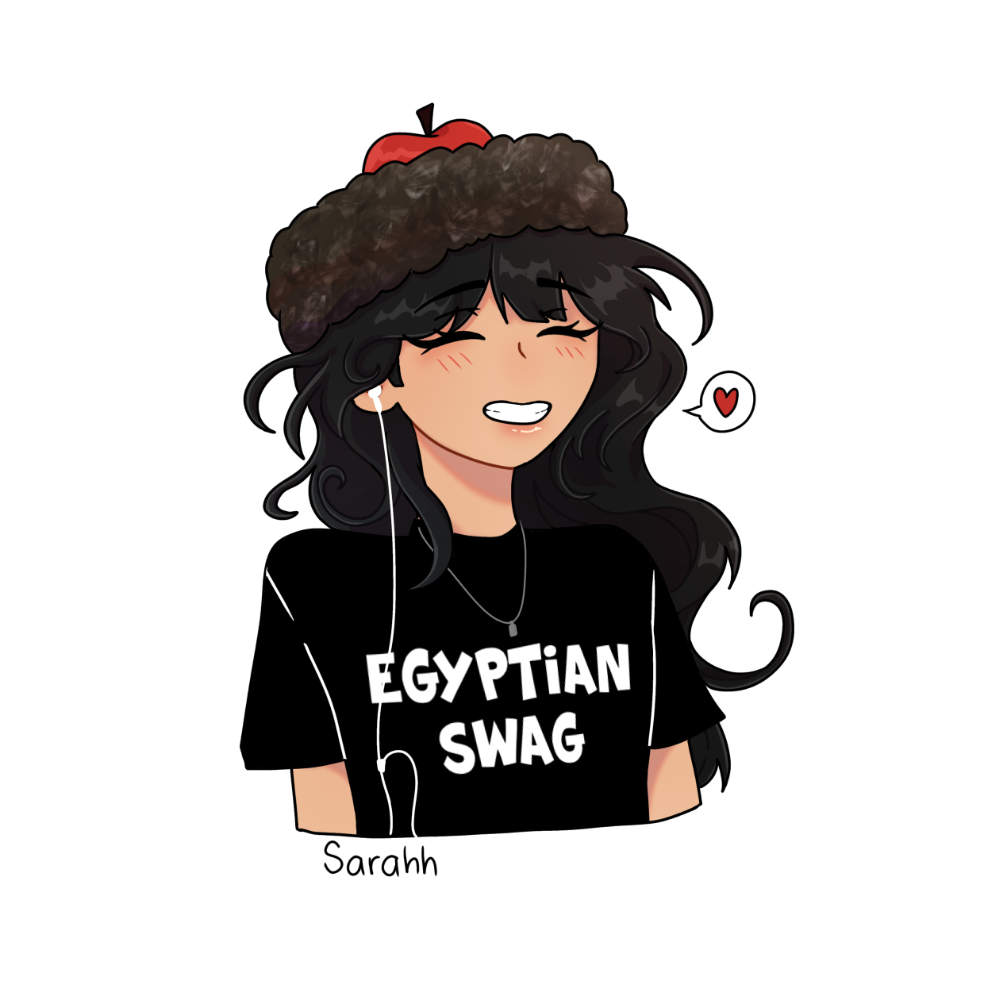
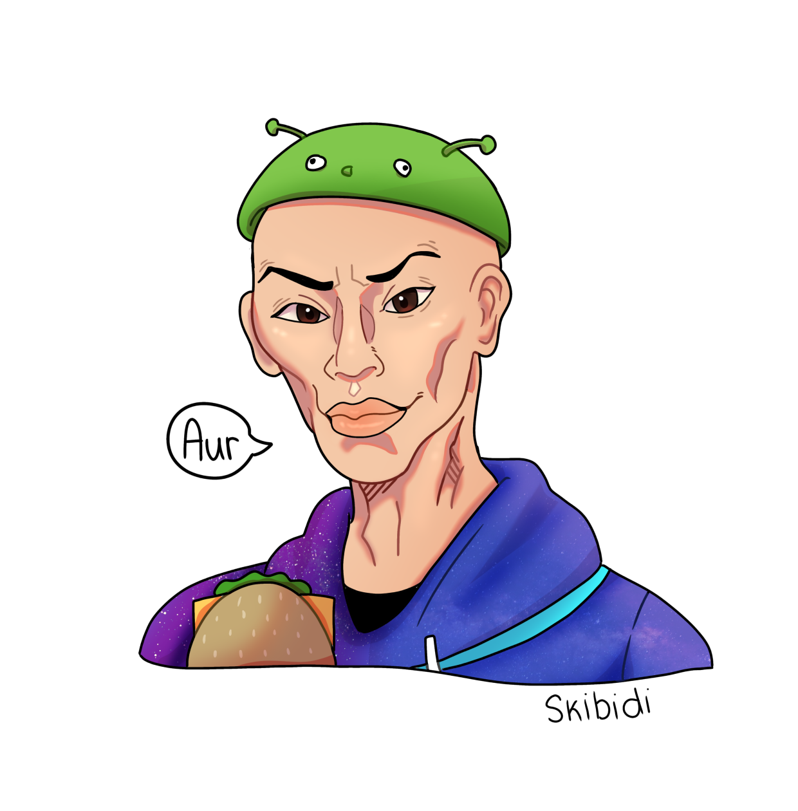
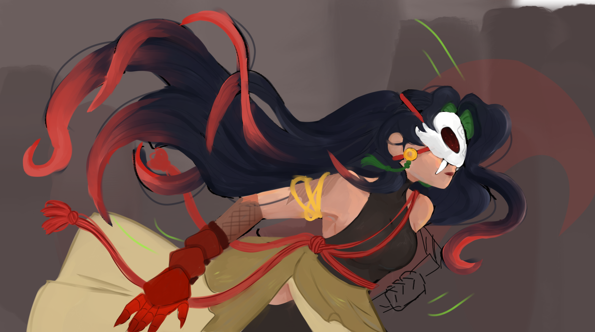

# Angelynne E  : *my-summer-in-markdown*
# **Introduction**
My name is Angelynne Elvambuena, I am a 12th grader at Chatsworth Charter High School. I love drawing and plan to go to a four year university to get a bachelor degree of fine arts. I am a middle child, with an older brother and sister, then a younger sister who attends Chatsworth as a freshman.
# **New Skills Learned**
Over the summer, I managed to raise my baking skills! I made Churro Cheesecake and Strawberry Shortcake over my summer vacation. I was really happy I could increase these skills of mine since baking is something I enjoy, and I also got to do all of this with my boyfriend whom I recently celebrated one year with!
# **Favorite Summer Food**
My favorite foods this summer have been between two different things. First off, watermelon! My favorite classic summer treat, since its easy to eat and is the best when its cold and crisp. I really like to blend some of the slices to create a sort of watermelon smoothie. Secondly, 99% cooked ground beef with seasoned salt. It's very good and easy to make, as well as a nice source of protein to snack on. It might seem a little strange to just straight up eat ground beef with seasoning on it, but I do find it to be one of my comfort foods since it's one of the easiest and quickest things for me to make.
# **Summer Playlist**
This summer I listened to...
### Obsessed - Luna Day
One of my favorite underground artists. She deserves so much more attention! I also suggest checking out her other songs Say It Back and her latest release Addicted! She recently had a small concert at a club but unfortunately you had to be 21+ years old to attend so I couldn't go.
### ABOVE BELOW - justice
I like to watch music videos released by vtuber groups! Although many think vtubers are cringe, I do enjoy their content and music since many of them have talent for singing! One of my favorites is Enna Alluoette, she is an amazing singer and has even released some songs of her own.
### After Midnight - Chappell Roan
CHAPPELL ROAN!! I love Chappell Roan, and am proud to say I listened to her before she made her hit "Good luck babe!". I love all of her songs, but my favorite has got to be After Midnight or My Kink is Karma. Hopefully one day I can attend one of her concerts/stage appearances!
# **Creative Endeavors**
This summer I drew some small things for fun, be it for my friends or personal art I wanted to create.
The first two are my friends avatars for Roblox, while the third is a drawing of my personal character.

  This is my friend's avatar, whom I drew because her avatar had such a cute and lovely aesthetic as well as hair.

  This drawing is one of my other friend's avatars, shes very silly and kind of brain rotted. I drew her avatar as a practice since I've never really drawn such a detailed face.

  Featured in this piece is my own original character, Leilin! I made her in 2022 and have been building her story for quite a while although I keep tending to scrap them and keep remaking them. Leilin is a warrior who houses the spirit of a snake alongside her.
